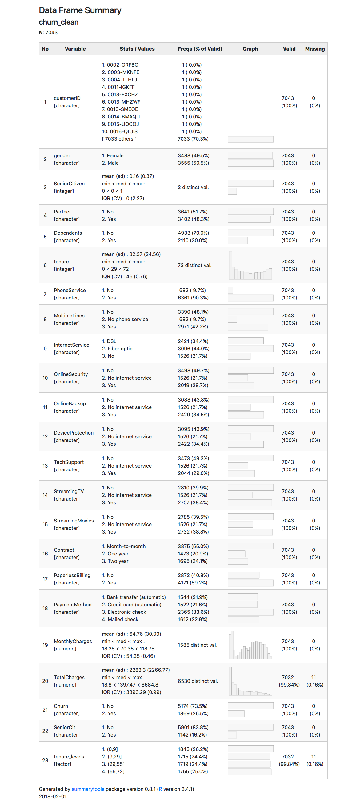

<center><h1>Customer Analysis</h1></center>
<br><br>

### Summary

This report includes sections with:

* 1. Background
* 2. Questions 
* 3. Exploratory data analysis
* 4. References

### 1. Background
<br>
<p>
**Customer churn or customer attrition:** Loss of clients or when customers stop doing business with a service or company. 
</p>
<p>
**Tenure:** A measure for how long the client/customer stays
</p>

### 2. Questions 


**What do we know about the data?**

Information from the article [**Using customer behavior data to improve customer retention**](https://www.ibm.com/communities/analytics/watson-analytics-blog/using-customer-behavior-data-to-improve-customer-retention/) 

**Data Quality and Validity**

1. Where does the data come from? How was data collected? 
2. Was data collected with any prior objective/purpose?
3. Is data suitable for the *Question*? (The company's problem/issue/questions)
4. Are there missing values in the data?

**Data Analysis questions**

*"A telecommunications company is concerned about revenue and the number of costumers leaving their landline business for cable competitors. They need to understand who is leaving. Imagine that we are analysts at this company and we have to find out who is leaving and why"*

1. What is the percentage of churn?
2. What can possibly cause the churn? What are the variables associated with churn?
3. How does costumer behavior vary and how does it influence the whole analysis?

### 3. Exploratory data analysis

#### 3.1. Libraries

```{r, libraries, message = FALSE, warning = FALSE}
library(tibble)
library(readr)
library(summarytools)
library(tidyverse)
```

#### 3.2. Read data

Data source: Telecom dataset from [IBM Sample Data Sets](https://www.ibm.com/communities/analytics/watson-analytics-blog/guide-to-sample-datasets/)

Telco costumer data set 
```{r, base r read data}
churn <- read.csv("data/Telco_Customer_Churn.csv")
```

```{r, readr package to read data}
# With read_csv from readr doens't convert variables into factors
churn_dat <- readr::read_csv("data/Telco_Customer_Churn.csv")

tibble::glimpse(churn_dat)
```

#### 3.3. Understand data

**Data variables meaning**

* Churn: Customers who left within the last month
* *Services that each customer has signed up for - phone, multiple lines, internet, online security, online backup, device protection, tech support, and streaming TV and movies*
* *Customer account information - how long they've been a customer, contract type, payment method, paperless billing, monthly charges, and total charges*
* *Demographic info about customers - gender, age range, and if they have partners and dependents*


```{r}
summarytools::descr(churn_dat)
```

#### 3.4 Data cleaning

We introduce some data cleaning here after realising variable SeniorCitizen is a dichotomic variable that should be converted to character type, with "yes" and "no" values.

```{r}
head(churn_dat)

churn_clean <- churn_dat %>%
        mutate(SeniorCit = recode(SeniorCitizen, `1` = "Yes", `0` = "No")) 

count(churn_clean, SeniorCit)
```

```{r}
quantile(churn_clean$tenure)
```

```{r}
churn_clean <- churn_clean %>%
        # create levels for tenure to categorize into different levels
        mutate(tenure_levels = cut(tenure, breaks = quantile(tenure))) 
churn_clean
```
Although I added a new variable `tenure_levels` with tenure divided into groups, I'm not following up with this variable without subject matter knowledge and not cleaning variable MultipleLines into values of "No" or "Yes" for the same reason. There is a need for more information in order to make decisions on the cleaning and variable transformations. 

#### 3.5. Answer questions

**1. What is the percentage of churn?**

```{r}
print(dfSummary(churn_clean), file = "Customer_churn_analysis_summary.html")
```



Data has 7043 observations and 21 variables. From the function `dfSummary` we can see there are 11 missing values (less than 1%) in the "TotalCharges" variable. The percentage of churn corresponds to 26.5% (1869 out of 5174 cases).

```{r}
head(churn_clean$TotalCharges)
```


How do missing values distribute across data?
```{r}
churn_mis <- churn_clean %>%
        mutate(Missing_TotalCharges = is.na(TotalCharges)) 

churn_mis %>%
        ggplot(mapping = aes(x = MonthlyCharges, y = ..density..)) +
        geom_freqpoly(mapping = aes(colour = Missing_TotalCharges)) +
        facet_grid(~Churn) +
        scale_color_brewer(palette = "Set2") +
        ggtitle("Distribution of monthly charges and churn") +
        labs(subtitle = "Missing Total charges in non-churn and churn cases") +
        scale_color_manual(values=c("#999999", "#E69F00", "#56B4E9"))
```

No missing values in churn cases, when we evaluate the proportional distribution of Monthly charges.

```{r, echo = FALSE, eval = FALSE}
churn_mis %>%
        ggplot(mapping = aes(x = MonthlyCharges)) +
        geom_histogram(mapping = aes(fill = Missing_TotalCharges), alpha = 0.5, binwidth = 5) +
        facet_grid(~Churn) +
        ggtitle("Distribution of monthly charges and churn") +
        labs(subtitle = "Missing Total charges in non-churn and churn cases") +
        scale_fill_manual(values=c("#999999", "#E69F00", "#56B4E9"))
        
```


```{r}
ggplot(data = churn_clean, mapping = aes(x = reorder(PaymentMethod, TotalCharges, FUN = median), y = TotalCharges, color = Churn)) + 
        geom_boxplot() +
        scale_color_brewer(palette = "Set2") +
        coord_flip() +
        ggtitle("Exploring Payment method and Total Charges") +
        scale_color_manual(values=c("#999999", "#E69F00", "#56B4E9"))
```

**What is churn distribution?**

```{r}
ggplot(churn_clean) + 
        geom_histogram(mapping = aes(x = TotalCharges, fill = Churn), alpha = 0.5, binwidth = 200) +
        scale_fill_manual(values=c("#999999", "#E69F00", "#56B4E9"))
```
The density plot shows a skewed distribution for total charges in churn and non-churn cases. Here we can explore whether there's a tendency for lower total charges values in churn cases. 

**What is churn distribution per contract type/time?**

```{r}
ggplot(churn_clean) + 
        geom_histogram(mapping = aes(x = TotalCharges, fill = Churn), alpha = 0.5, binwidth = 800) + 
        facet_wrap(~Contract) +
        scale_fill_manual(values=c("#999999", "#E69F00", "#56B4E9"))
```

```{r}
ggplot(churn_clean) + 
        geom_boxplot(mapping = aes(x = Churn, y = TotalCharges, fill = Churn), alpha = 0.5, binwidth = 800) +
        scale_fill_manual(values=c("#999999", "#E69F00", "#56B4E9"))
```

In average total charges are lower in churn cases than non-churn cases.

```{r}
ggplot(churn_clean) + 
        geom_boxplot(mapping = aes(x = Churn, y = MonthlyCharges, fill = Churn), alpha = 0.5, binwidth = 800) +
        scale_fill_manual(values=c("#999999", "#E69F00", "#56B4E9"))
```


This plot contrast with the plot above showing churn cases with higher average of monthly costs. This deserves further exploration for monthly charges with a histogram.

```{r}
ggplot(churn_mis) + 
        geom_histogram(mapping = aes(x = MonthlyCharges, fill = Churn), alpha = 0.5, binwidth = 3) +
        geom_density(aes(y = 3 * ..count.., x = MonthlyCharges, color = Churn)) +
        facet_wrap(~Contract) +
        scale_fill_manual(values=c("#999999", "#E69F00", "#56B4E9")) +
        scale_color_manual(values=c("#999999", "#E69F00", "#56B4E9"))
```

This plot shows a different distribution of monthly charges per type of contract, showing more cases of churn in a month-to-month type of contract. 

```{r}
ggplot(churn_mis) + 
        geom_density(mapping = aes(x = MonthlyCharges, fill = Churn), alpha = 0.5) +
        scale_fill_manual(values=c("#999999", "#E69F00", "#56B4E9"))
```


Proportionally there's more cases of churn with higher monthly charges. 

```{r}
ggplot(churn_mis) + 
        geom_density(aes(y = 3 * ..count.., x = TotalCharges, fill = Churn), alpha = 0.5) +
 facet_grid(~Contract) +
        scale_fill_manual(values=c("#999999", "#E69F00", "#56B4E9"))
```


We can see the same proportion for total charges distribution. With higher proportion of churn cases in a month-to-month type of contract.

```{r}
ggplot(churn_mis) + 
        geom_density(mapping = aes(x = TotalCharges, fill = Churn), alpha = 0.5) +
        scale_fill_manual(values=c("#999999", "#E69F00", "#56B4E9"))
```

Crossing two categorical variables (Churn and Contract) to understand where more number of Churn cases occur.
```{r}
churn_mis %>%
        count(Churn, Contract) %>%
        ggplot(mapping = aes(x = Contract, y = Churn)) +
        geom_tile(mapping = aes(fill = n)) 
```


**Removing missing values from the dataset**
```{r}
churn_new <- churn_mis %>%
        filter(complete.cases(.))
churn_new
```

**What are the variables associated to churn?**
```{r}
ggplot(churn_new) + geom_point(aes(y = TotalCharges, x = tenure, color = Churn)) + 
        scale_color_manual(values=c("#999999", "#E69F00", "#56B4E9"))
```

Since we have many data points we'll use two dimentions bins (geom_hex() divides the coordinate plane into 2d bins)
```{r}
ggplot(churn_new) + 
        geom_hex(aes(y = TotalCharges, x = tenure, fill = Churn)) +
        scale_fill_manual(values=c("#999999", "#E69F00", "#56B4E9"))
```

This was an exploratory data analysis of the data. Further analysis to predict customer churn would require more knowledge about the data (such as the way data was collected and how each variable was defined and classified).  

### 4. References

* https://datascienceplus.com/predict-customer-churn-logistic-regression-decision-tree-and-random-forest/
* http://r4ds.had.co.nz/
* http://dplyr.tidyverse.org/reference/recode.html
